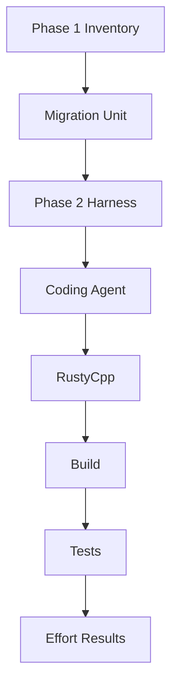
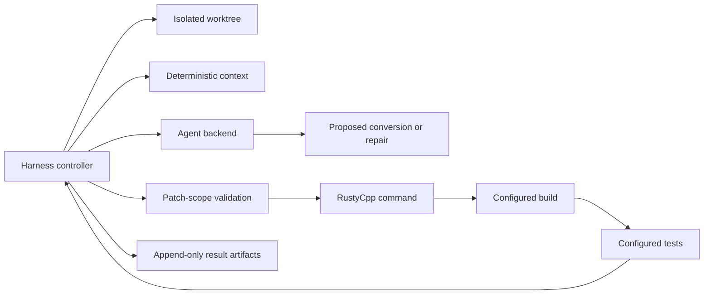

# Phase 2 migration harness

Phase 2 is controlled by `harness`, not by the coding agent. A selected
`MigrationUnit` is evaluated in an isolated detached worktree at its recorded
commit. The eventual sequence is baseline build/tests, deterministic context,
agent proposal, independent patch validation, RustyCpp, build, targeted tests,
and bounded repairs.

The current implementation is scaffolding. `python -m harness.cli dry-run`
only validates inputs and prints this intended sequence: it creates no
worktree and invokes no coding agent, RustyCpp, build, test, or benchmark.

Configured commands are argument arrays, not guessed shell commands. Every
real run must record target/RustyCpp commits, command outputs, durations,
attempts, measured token provenance, and preserved failed attempts beneath
`results/<application>/<experiment-id>/`.

## Phase relationship

## Harness architecture

